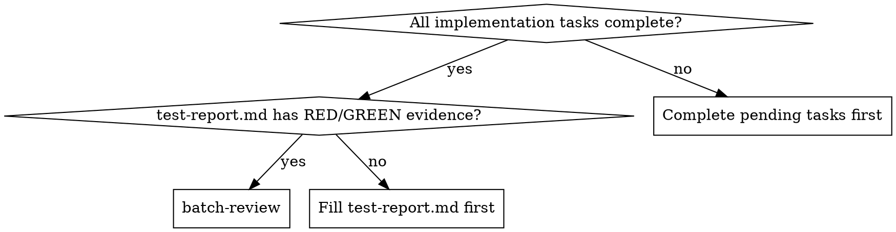
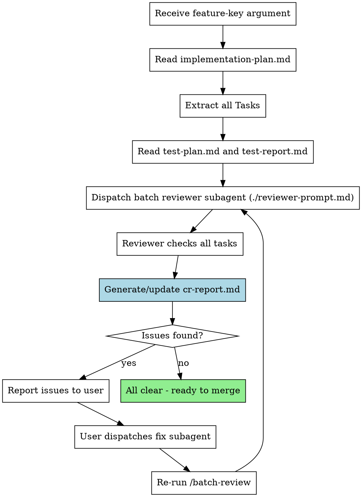

# Batch Review

Run batch code review after all implementation tasks are complete. Reviews all tasks at once for efficiency.

**Core principle:** One batch review > many per-task reviews. Same quality, fewer subagent calls.

## When to Use



## Usage

```
/batch-review <feature-key>
```

**Example:**
```
/batch-review user-auth
```

## The Process



## Input Files

The skill reads these files from `docs/features/<feature-key>/`:

| File | Purpose |
|------|---------|
| `implementation-plan.md` | List of all tasks to review |
| `test-plan.md` | Test specifications (TC-XXX IDs) |
| `test-report.md` | TDD evidence (RED/GREEN) |
| `prd.md` | Original requirements |

## Output

Creates or updates `docs/features/<feature-key>/cr-report.md`:

```markdown
# Code Review Report: <feature-key>

**Date:** YYYY-MM-DD
**Overall Status:** PASS / FAIL / WARN

## Summary
- Tasks reviewed: N
- Passed: N
- Failed: N
- Warnings: N

## Task Reviews

### Task 1: [Task Name]
**Status:** PASS / FAIL / WARN

**TDD Compliance:**
- [ ] All Test IDs have RED evidence
- [ ] All Test IDs have GREEN evidence

**Spec Compliance:**
- [ ] All requirements implemented
- [ ] No extra/unneeded features

**Code Quality:**
- Strengths: ...
- Issues: ...

### Task 2: [Task Name]
...

## Critical Issues (Must Fix)
1. [Issue description, file:line]

## Warnings (Should Fix)
1. [Issue description, file:line]

## Recommendations
1. [Improvement suggestion]
```

## Prompt Template

See `./reviewer-prompt.md` for the subagent prompt template.

## Efficiency Comparison

| Approach | 5 Tasks | 10 Tasks |
|----------|---------|----------|
| Per-task review (old) | 15 calls | 30 calls |
| Batch review (new) | 6 calls | 11 calls |
| Savings | 60% | 63% |

## Red Flags

**Never:**
- Run batch review before all tasks complete
- Skip batch review before merging (quality matters)
- Ignore critical issues in the report
- Accept incomplete test-report.md

**If issues found:**
- Dispatch fix subagent for each issue
- Re-run `/batch-review` after fixes
- Repeat until PASS

## Integration

**Works with:**
- **superpowers:subagent-driven-development** - Run batch-review after all tasks
- **superpowers:finishing-a-development-branch** - Run after batch-review passes

**Replaces per-task:**
- `spec-reviewer-prompt.md` (now batched)
- `code-quality-reviewer-prompt.md` (now batched)
