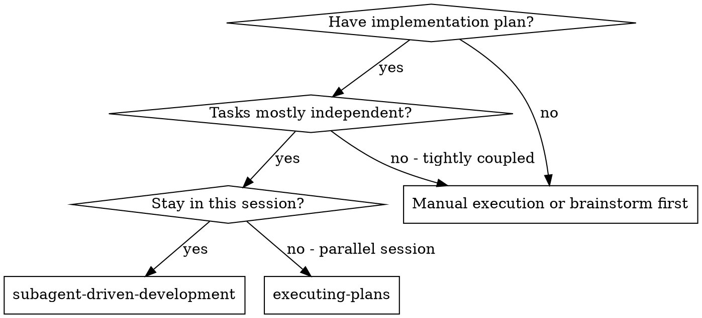
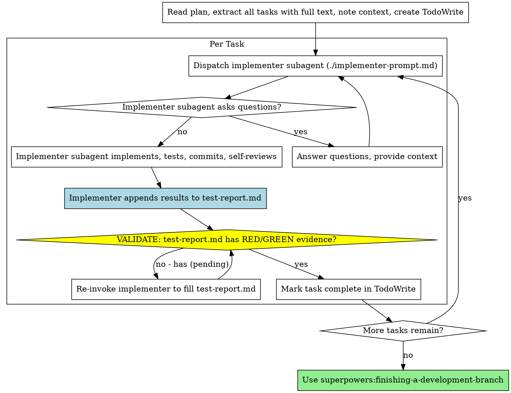

# Subagent-Driven Development

Execute plan by dispatching fresh subagent per task. Each implementer self-reviews and validates TDD evidence.

**Core principle:** Fresh subagent per task = fast iteration. TDD + self-review = quality without overhead.

## When to Use



**vs. Executing Plans (parallel session):**
- Same session (no context switch)
- Fresh subagent per task (no context pollution)
- Faster iteration (no human-in-loop between tasks)

## The Process

**Initialization:**
1.  **Ask for Feature Key:** "Please provide the `feature-key` for this implementation (e.g., `user-auth`)."
2.  **Verify Test Plan Exists:** Check if `docs/features/<feature-key>/test-plan.md` exists.
    *   **If NO:** STOP. Error: "test-plan.md must exist before implementation. Run writing-plans skill first."
    *   **If YES:** Proceed with implementation tasks (test-plan.md was created during planning phase).



## Prompt Templates

- `./implementer-prompt.md` - Dispatch implementer subagent
- `./spec-reviewer-prompt.md` - (Legacy) Not used in main flow
- `./code-quality-reviewer-prompt.md` - (Legacy) Not used in main flow

## Example Workflow

```
You: I'm using Subagent-Driven Development to execute this plan.

[Read plan file once: docs/plans/feature-plan.md]
[Extract all 5 tasks with full text and context]
[Create TodoWrite with all tasks]

Task 1: Hook installation script

[Get Task 1 text and context (already extracted)]
[Dispatch implementation subagent with full task text + context]

Implementer: "Before I begin - should the hook be installed at user or system level?"

You: "User level (~/.config/superpowers/hooks/)"

Implementer: "Got it. Implementing now..."
[Later] Implementer:
  - Implemented install-hook command
  - Added tests, 5/5 passing
  - Self-review: Found I missed --force flag, added it
  - Updated test-report.md with RED/GREEN evidence
  - Committed

[Validate test-report.md has evidence]
[Mark Task 1 complete]

Task 2: Recovery modes

[Get Task 2 text and context (already extracted)]
[Dispatch implementation subagent with full task text + context]

Implementer: [No questions, proceeds]
Implementer:
  - Added verify/repair modes
  - 8/8 tests passing
  - Self-review: All good
  - Updated test-report.md
  - Committed

[Mark Task 2 complete]

...

[After all tasks complete]
[Use superpowers:finishing-a-development-branch]

Done!
```

## Advantages

**vs. Manual execution:**
- Subagents follow TDD naturally
- Fresh context per task (no confusion)
- Parallel-safe (subagents don't interfere)
- Subagent can ask questions (before AND during work)

**vs. Executing Plans:**
- Same session (no handoff)
- Continuous progress (no waiting)

**Efficiency gains:**
- No file reading overhead (controller provides full text)
- Controller curates exactly what context is needed
- Subagent gets complete information upfront
- Questions surfaced before work begins (not after)
- No per-task reviewers - just implementer per task

**Quality gates:**
- Self-review catches issues before handoff
- **TDD Proof:** `test-report.md` must contain RED/GREEN evidence with strict Test ID mapping:
  - Every Test ID from `test-plan.md` must appear in `test-report.md`
  - Every test must have documented RED evidence (failure message, file, line number)
  - Every test must have documented GREEN evidence (pass confirmation, duration)
  - If code passes immediately without recorded RED evidence, TDD was violated - task is INVALID

**Cost:**
- Minimal subagent invocations (implementer per task only)
- Controller does more prep work (extracting all tasks upfront)
- Efficient: 5 tasks = 5 subagent calls

## MANDATORY: Report Validation Checkpoint

**After each implementer subagent completes, BEFORE marking task complete:**

1. **Read `test-report.md`** and check for `(pending)` entries
2. **If ANY `(pending)` entries exist for the current task's Test IDs:**
   - ❌ STOP - Do NOT mark task complete
   - Re-invoke implementer with explicit instruction:
     ```
     "You completed the implementation but did NOT update test-report.md.
      Update it NOW with RED and GREEN evidence for: [list Test IDs]"
     ```
   - Verify again after implementer responds
3. **Only mark task complete when:**
   - ✅ All Test IDs for current task have RED evidence (actual error messages)
   - ✅ All Test IDs for current task have GREEN evidence (pass confirmation)
   - ✅ No `(pending)`, `TBD`, or `N/A` entries remain

**Validation command:**
```bash
grep -n "(pending)" docs/features/<feature-key>/test-report.md
# If any output → FAIL validation → re-invoke implementer
# If no output → PASS validation → mark task complete
```

**Why this matters:**
- Implementer subagents sometimes "forget" to update reports
- Empty reports make TDD verification impossible
- This checkpoint ensures reports are always filled

## Red Flags

**Never:**
- **Skip report validation checkpoint** (MUST verify test-report.md before marking task complete)
- Dispatch multiple implementation subagents in parallel (conflicts)
- Make subagent read plan file (provide full text instead)
- Skip scene-setting context (subagent needs to understand where task fits)
- Ignore subagent questions (answer before letting them proceed)
- **Accept test reports without strict Test ID mapping** (Every TC-XXX in test-plan.md must have matching entry in test-report.md)
- **Accept test reports without detailed RED evidence** (Must include: error message, file name, line number)
- **Accept test reports without detailed GREEN evidence** (Must include: pass confirmation, assertions verified, duration)
- **Accept test reports missing any of: Executive Summary, Coverage Report, Requirements Coverage, Classification Summary**

**If subagent asks questions:**
- Answer clearly and completely
- Provide additional context if needed
- Don't rush them into implementation

**If subagent fails task:**
- Dispatch fix subagent with specific instructions
- Don't try to fix manually (context pollution)

## Integration

**Required workflow skills:**
- **superpowers:writing-plans** - Creates the plan this skill executes
- **superpowers:finishing-a-development-branch** - Complete development after all tasks

**Subagents should use:**
- **superpowers:test-driven-development** - Subagents follow TDD for each task

**Alternative workflow:**
- **superpowers:executing-plans** - Use for parallel session instead of same-session execution
